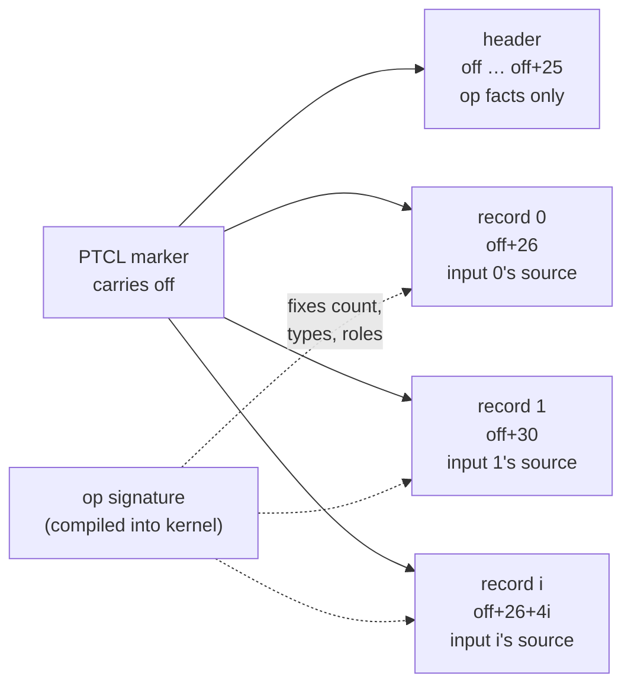

# Operand records — the descriptor ABI and its migration

Normative companion to the contract in `renderer/2D/core/src/vello/bake.rs` (module docs).
One rule at every size: **an arm's inputs are a list of fixed-stride records; structure lives in
the contract, only sources live in the data.**

**Status: LIVE (2026-08-31).** The migration below is complete: every mark packs 26 header floats
plus 4 records (`REC_COUNT`/`REC_STRIDE` in bake.rs), `fx_load_desc` is the single parser building
the whole arm (header + records), and header bits 15+ are free. The battery was byte-identical
across all 24 scenes on the switch.

## Target layout

Every CMD_EFFECT marker carries one buffer index, `off`. Everything the arm needs sits at fixed
distances from it inside `effect_params`:

```
effect_params (one storage buffer, uploaded once per frame)

off ──► ┌──────────┬──────────┬──────────────────────────────────────┐
        │ d0 bits  │ d1 math  │ d2 … d25  unit payload               │  header: 26 × f32
        └──────────┴──────────┴──────────────────────────────────────┘
        ┌──────────┬──────────┬──────────┬──────────┐
off+26  │ source   │ window x │ window y │ param    │  record 0  = input 0
        ├──────────┼──────────┼──────────┼──────────┤
off+30  │ source   │ window x │ window y │ param    │  record 1  = input 1
        ├──────────┼──────────┼──────────┼──────────┤
off+34  │   ...    │   ...    │   ...    │   ...    │  record i  = input i
        └──────────┴──────────┴──────────┴──────────┘
                     record i at  off + 26 + i × 4
```



Invariants:

- **Header = op facts.** Which units run (bits 0–14), which field math (d1), unit parameters
  (sigma, magnitudes, colour). Never anything about where inputs come from.
- **Record = source facts.** Where input `i`'s data comes from, and nothing else.
- **Position is identity.** Record `i` is `inputs[i]` of the DAG node. No delimiters, no
  scanning — `off + 26 + i × 4` is an address, not a search.
- **Nothing static is stored.** Count comes from the op's signature; types come from
  `(op, index)`; both are compiled into the kernel's read sites.
- **One indirection.** `off` is the only pointer; records ride it at a fixed distance. A record
  never points further.
- **Uniform stride.** Every record is 4 floats. Unused fields are don't-cares (zeros). A wider
  source kind widens the stride constant for everyone; records never self-describe their size.

## Record fields

| field | meaning | generated source (code 0) | sampled source (code ≥ 1) |
|---|---|---|---|
| `source` | which kind of place feeds this input: `0` generated by the arm's field math, `1` accumulator/backdrop, `2` strip, `3` draft | `0` | register id |
| `window x`, `window y` | the input's **coordinate frame origin**, device px | the field's anchor (noise grain origin, box local frame) | where this input's region starts inside the shared texture |
| `param` | per-source interpretation | don't-care | SDF decode range, atlas lease origin, … |

`window` is the generalization of today's scattered plumbing: the strip offsets (`d6…d9`), the
blur atlas store/tap origins (`u1.xy` / `u1.zw`), the noise anchor (`u2.xy`), the box local frame
(`u0.zw`) — all the same fact, one home. The noise-phase landmine (grain speckle from a
one-pixel-wrong anchor) is a wrong `window` on a *generated* record.

## Worked example

Shape 0x2A: rounded rect, texture (noise r10, grain 20) + layer blur 4 + filter offset (10, 8).
Body strip slot at device (1216, 0); its effect extent's device origin is (301, 447); the offset's
device vector is (10, 8), so the noise anchor is (311, 455).

Arm 1 of the chain — the fused warp+clip that materializes the warped body:

```
header  d0 = WARP | CLIP | RAW          d1 = 2 (noise math)
        d2… = magnitude 30.0, grain 20.0, clip 1.0 …   (op facts)

record 0  (value: the rasterized body)
        source   = 2        strip
        window x = 1216.0   body slot's x origin in the strip
        window y = 0.0      body slot's y origin
        param    = 0.0      don't-care

record 3  (field distance: generated noise; records 1–2 are don't-cares here)
        source   = 0        generated
        window x = 311.0    grain anchor x  (extent origin 301 + offset 10)
        window y = 455.0    grain anchor y  (extent origin 447 + offset 8)
        param    = 0.0      don't-care
```

Kernel reads, all indices compile-time:

```wgsl
let r0 = off + 26u;                       // value record
let r3 = off + 38u;                       // field record
let body = textureLoad(strip, px - vec2(params[r0+1], params[r0+2]));
let fld  = noise((fc - vec2(params[r3+1], params[r3+2])) / grain);
```

The same arm under the sampled-SDF variant of the field differs by one record, not one shader:

```
record 3  source = 2 (strip), window = SDF slot origin, param = decode range
```

## Migration map (pre-record encoding → records) — executed

| today | becomes |
|---|---|
| bit 15 (value register) | record 0 `source` |
| bit 16 (reference register) | record 1 `source` |
| bit 17 (coverage register) | record 2 `source` |
| bit 18 (field distance register) | field record `source` |
| `d6…d9` strip window offsets | value/reference record `window` |
| `u1.zw` blur atlas tap origin | blur input record `window` |
| `u2.xy` noise anchor | field record `window` (generated) |
| `u0.zw` box local frame | field record `window` (generated) |
| `d8` SDF decode | field record `param` |
| header bits 15–23 | freed |

Sequencing: this migration runs before (or with) the fx_offset retirement and the field-program
table — records subsume field leaves. Gate: the full `wv_effect_ab` battery, byte-identical on
every scene, per phase.
