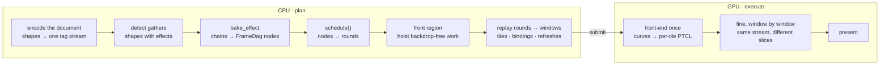
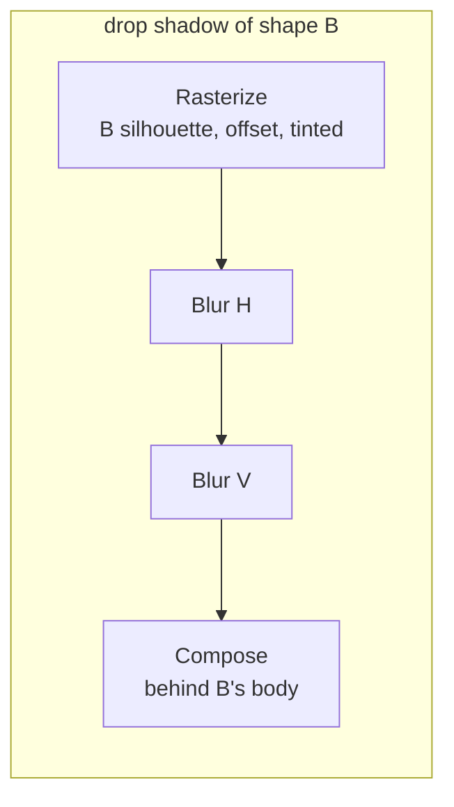
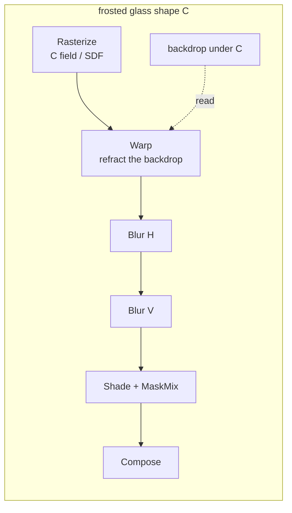
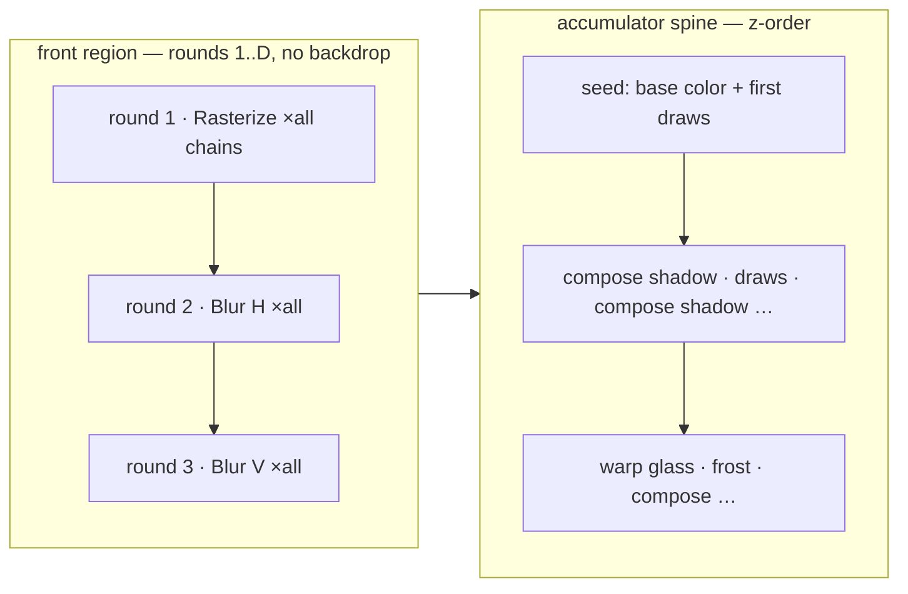
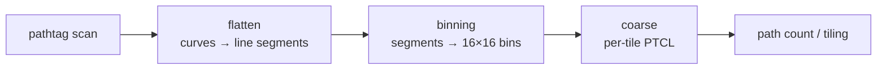

# Whole-Viewport Renderer

The algorithm of the classic Vello backend, end to end: how a document becomes an effect
DAG, how the DAG becomes a schedule, and how the GPU executes it as windows over one
command stream.

- [1 · The one big idea](#1--the-one-big-idea)
- [2 · From document to DAG](#2--from-document-to-dag)
- [3 · Scheduling: rounds and the front region](#3--scheduling-rounds-and-the-front-region)
- [4 · The command stream the GPU reads](#4--the-command-stream-the-gpu-reads)
- [5 · How the GPU runs it](#5--how-the-gpu-runs-it)
- [6 · The texture cast](#6--the-texture-cast)
- [7 · A frame, walked end to end](#7--a-frame-walked-end-to-end)
- [8 · The contract that holds it together](#8--the-contract-that-holds-it-together)

## 1 · The one big idea

A tile renderer would cut the document into pieces and render each piece as its own little
scene. The whole-viewport renderer does the opposite: the entire document is encoded as
**one** Vello scene, and the expensive front half of the pipeline — turning curves into
per-tile command lists — runs **once per frame**. Everything interesting after that,
including every effect, is expressed as re-running the cheap back half (`fine`, the
per-pixel rasterizer) over **slices** of that single command stream, against different
texture bindings.

This creates a clean division of labor:

- The **CPU is the planner**. It builds a dependency graph of all effect work, schedules
  it, and emits an exact plan: which slice of the stream runs when, over which tiles,
  reading and writing which textures.
- The **GPU is the executor**. It runs the plan verbatim. No shader ever makes a decision
  the planner could have made; the same `fine` program executes plain fills, shadow
  composites and glass alike, told apart only by what the plan bound to its slots.



## 2 · From document to DAG

*(CPU)*

### 2.1 The scene stream

Each frame walks the live document in z-order and encodes every shape into Vello's tag
stream: path tags, flattened path data, draw tags, transforms. Crucially, when the walk
crosses an effect boundary it emits a `CMD_EFFECT` marker into the stream — a numbered
bookmark saying "everything before this point is the backdrop of effect *n*". The stream
is the frame's single source of truth for **what** to draw; the DAG will describe **how**
and **when**.

### 2.2 Gathers and the unit alphabet

A shape carrying effects — a drop shadow, a layer blur, an inner shadow, glass — is a
*gather*. Its effect chain is baked by `bake_effect` into nodes of the `FrameDag`, and
every node's operation comes from one small shared alphabet, the `UnitOp`s:

| unit | what it does |
| --- | --- |
| `Rasterize` | Run fine over a slice of the stream into a texture — a shape's silhouette, a shadow source, an inner-shadow flood. There is no special "flood" op; a flood *is* a rasterize. |
| `Blur` | One separable Gaussian pass. The node carries its axis (H or V) and its edge policy (what an escaped tap reads: transparent for coverage, the page for backdrop), stamped at DAG build. |
| `Warp` / `Scatter` / `Shade` / `MaskMix` | The glass decomposition: refract the backdrop through the shape's field, scatter for frost, shade, and mix through the mask. Sharp glass fuses to a single op. |
| `Reload` | Re-read a previously materialized result. |
| `Compose` | Blend a finished chain result into the running image, at the right point in z-order. |

Edges between nodes are real data dependencies — "this blur reads that rasterize's
output" — and each node knows its *reach*: the device-space rectangle its output can
possibly touch (a blur's reach is its source padded by 3σ). There are no kind tags, no
flags, no special-cased effect types anywhere downstream: everything an executor needs is
derivable from the units and their edges.

### 2.3 Two chains, drawn out





Note the one structural difference that will matter for scheduling: the shadow chain's
first node reads only shape geometry, but the glass chain's `Warp` reads **the
backdrop** — the pixels already composited beneath C. That read is an edge into the
frame's running image, and it pins the chain into the frame's z-order.

### 2.4 Binding slots

Every node also records a *binding shape*: which of fine's three texture slots its
dispatch fills — `base` (what's behind me: the backdrop snapshot, a co-located source, or
nothing), `input` (a chained intermediate: a draft, or slot 10 for a blur result), and
`output` (a private draft lease, or the accumulator). The binding shape is not a tag — it
is *derived* from the units, and it alone selects which fine permutation the executor
dispatches. Nodes whose rounds coincide must share a binding shape; that is what lets many
nodes ride one dispatch.

## 3 · Scheduling: rounds and the front region

*(CPU)*

### 3.1 Rounds

`schedule()` walks the DAG in dependency order and assigns each node a *round* — an
integer barrier ordinal. The rule is minimal: a node lands in a round strictly after all
its inputs' rounds, and nodes with no path between them may share a round. Two shadow
chains on opposite sides of the canvas don't order each other; both their H-blurs can land
in the same round and later ride one dispatch. A round boundary exists **only** where data
actually flows.

### 3.2 The front region

The schedule then gets one global transformation. Ask of every node: does its window bind
any accumulator state? A silhouette rasterize doesn't — it writes a private draft from
geometry alone. A shadow's blurs don't — they read the silhouette draft. But a glass warp
does — it reads the backdrop.

Every node whose whole read spine is backdrop-free is *hoisted to the front*: re-rounded
into rounds 1..D, grouped by (chain depth × binding class). The result is that all 500
silhouettes rasterize in one giant round, all first blurs in the next, all second blurs
after — before the frame's z-order spine even begins. A restore marker after the front
block re-seeds fine's per-tile state, and the spine then runs with every chain's
ingredients already sitting in their drafts.



Glass chains stay in the spine from the warp onward — their backdrop read *is* the
dependency — but even their field rasterize hoists. Depth grouping matters because a
chain's blur-V cannot share a round with its own blur-H; grouping by depth lines up the
independent chains instead.

### 3.3 Marks

The schedule's output is a set of `UnitMark`s — per-node records stamped with the node's
round, its op parameters, its reach, and its record coordinates (where in its lease the
output lands). Marks are the entire interface between planning and execution: the executor
reads marks, never the DAG.

## 4 · The command stream the GPU reads

*(GPU · built once per frame)*

On submit, the classic Vello front-end runs over the uploaded tag stream:



The product is the **PTCL**: for every 16×16 tile of the viewport, a compact command list
of exactly the draws crossing that tile, in z-order, with the `CMD_EFFECT` markers
embedded at the effect boundaries. A marker is binned only into the tiles inside its
effect's reach, and it carries its segment index in its payload — a tile's thread **sets**
its running segment counter from the marker rather than counting markers, so tiles a chain
never touches pay nothing for it.

This stream is immutable for the rest of the frame. Every effect pass that follows is fine
re-reading a slice of it.

## 5 · How the GPU runs it

*(GPU)*

### 5.1 Windows

The executor replays the rounds as *windows*: intervals `[lo, hi)` of rounds, each
becoming one fine dispatch. For each window the plan carries:

- **a sparse tile list** — the union of its marks' reach rectangles, as packed tile
  words. The dispatch is `(n, 1, 1)` workgroups; workgroup *i* reads its tile coordinate
  from entry *i*. A window whose effect touches 40 tiles costs 40 workgroups, not the
  viewport. A tile word can also carry a per-entry round range, which is how several
  independent same-class windows merge into one dispatch.
- **a binding assignment** — the textures for base / input / output, chosen by the
  round's binding shape.
- **snapshot refresh rects** — see 5.3.

### 5.2 Inside a fine workgroup

Each workgroup owns one 16×16 tile. Conceptually its thread runs:

```text
rgba  = load own pixels (accumulator window)  or  seed from base
walk this tile's PTCL:
    CMD_EFFECT marker  → set running segment index from payload
    segment outside [lo, hi)  → skip
    segment inside:
        fill / stroke / clip commands  → shade into rgba
        mark's OUTPUT record  → store into the mark's lease
        (flush-flagged mark  → store, then reseed for the next producer)
store rgba back (accumulator)  or  store draft
```

The same program serves every window; the plan varies only which texture sits in which
slot. The binding shape selects one of a few compiled permutations:

| permutation | binds | role |
| --- | --- | --- |
| `fine_area_u` | acc | seed the frame: base color + round-0 draws |
| `fine_area_draft` | draft | front rasterize: silhouettes into leases |
| `fine_area_load_*` | snap / source + draft | materialize a chain stage into its draft |
| `fine_area_rwu` | snap + acc | in-place composite over own pixels |
| `fine_area_rwu_draft` / `_input` | snap + slot 10 + acc | composite reading a blur draft or chained input |
| `snap_copy` | acc → snap | the backdrop refresh, as a tile-table copy |

### 5.3 The backdrop rule

One invariant makes the whole spine sound: **the accumulator is never bound readable while
it is being written**. Any mark that asks "what is behind me?" reads the *snapshot*
instead — a second texture holding a copy of exactly the rects that window's marks can
read, each padded by the mark's tap margin (3σ for a blur's escaped taps, a flat allowance
for warp displacement). Just before a backdrop-reading window runs, a `snap_copy` dispatch
refreshes those rects from the accumulator.

This is why hundreds of composites can be recorded back to back inside one compute pass:
WebGPU scopes memory visibility per dispatch, so dispatch *k* writes the accumulator,
dispatch *k+1* copies the touched rects into the snapshot, and dispatch *k+2* samples the
snapshot — sequenced, hazard-free, and never closing the pass. Windows that bind no
snapshot skip the refresh entirely.

### 5.4 What the encoder ends up holding

```text
[ seed ][ front·rasterize ×all ][ front·blur ×all ][ snap_copy ][ compose w5 ][ compose w6 ][ snap_copy ][ warp w7 ] … [ present ]
└──────────────────────────────── one shared compute pass ─────────────────────────────────┘
```

Consecutive dispatches share one compute pass; only a genuine encoder event (frame clear,
the periodic submit watchdog, present) closes it. Ordering between dispatches is
guaranteed by WebGPU's per-dispatch synchronization scopes.

## 6 · The texture cast

| texture | format | role |
| --- | --- | --- |
| accumulator | r32uint | The frame's packed running image. Composites read-modify-write their own pixels. Write-side only while the spine runs. |
| snapshot | r32uint | The backdrop the effects read. Refreshed per window, rects only, by `snap_copy`. |
| source strip | rgba8 | In-scene materialized sources for gathers — the only source path. Copied out per shape on demand. |
| atlas sides | rgba8 | Leased scratch for chain drafts: silhouettes, blur ping-pong, SDF bakes, warp results. Demand-sized; leases live from a node's write round to its last read. |

## 7 · A frame, walked end to end

Three shapes: **A**, a plain rectangle at the back; **B**, a circle with a drop shadow;
**C**, a frosted glass panel over both.

**Plan (CPU).** The walk encodes A, B and C into one stream, dropping a `CMD_EFFECT`
marker before B's shadow composite point and before C's glass. Two gathers are baked: B's
chain (Rasterize → BlurH → BlurV → Compose) and C's (Rasterize field → Warp → BlurH →
BlurV → Shade → Compose). `schedule()` gives every node a round; the front pass then
hoists everything backdrop-free — B's silhouette *and* C's field rasterize into round 1,
B's two blurs into rounds 2 and 3. C's warp cannot hoist: it reads the backdrop, so it and
everything after it stay in the spine.

**Execute (GPU).** The front-end builds the PTCL once. Then the windows run, all inside
one compute pass:

| window | what happens |
| --- | --- |
| seed | `fine_area_u`: every tile seeds from the page color and draws A. |
| front `[1,4)` | Three dispatches over the chains' reach tiles: B's silhouette and C's field rasterize into their leases; B's shadow blurs H then V, draft to draft. |
| spine · compose shadow | `snap_copy` refreshes the snapshot rects under B's shadow reach, then `fine_area_rwu_draft` runs over those tiles: each walks its PTCL to B's marker, composites the blurred draft (slot 10) over the snapshot backdrop into the accumulator. |
| spine · B's body | The same z-order slice carries B's body draws; they shade into the accumulator in stream order — no separate machinery for plain content. |
| spine · glass | `snap_copy` refreshes the rects under C. `fine_area_load_*` materializes the warp: sample the snapshot through C's field, write the refracted image to a draft. Frost blurs run draft to draft. A final `rwu` window shades and mask-mixes the result into the accumulator. |
| present | The packed accumulator is unpacked and blitted to the swapchain. |

Scale that picture up and nothing changes shape: with 500 effect shapes the front region
is still three-ish dispatches (each covering all chains at that depth), the spine is one
window per z-order composite point, and the whole frame is still one command stream read
many times.

## 8 · The contract that holds it together

**The planner decides everything; the executor decides nothing.** The plan is a flat list
the executor runs as a dumb VM. There are no kind tags, flags or effect enums in the
execution path — every dispatch's behavior derives from its units and its binding shape.
Adding an effect means adding a `UnitOp` and a bake rule, never a branch in the executor.

**Barriers only where data flows.** Rounds come from real edges; window boundaries come
from rounds; everything without an edge shares dispatches. The dependency graph, not any
fixed pipeline, is the frame's structure.

**Correctness is byte-exact.** Every structural change to this pipeline is gated by a
24-scene battery rendered against an independent tiled oracle and compared pixel for
pixel.
