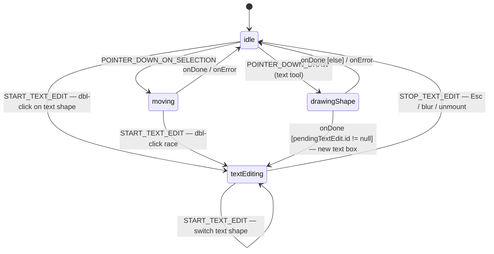
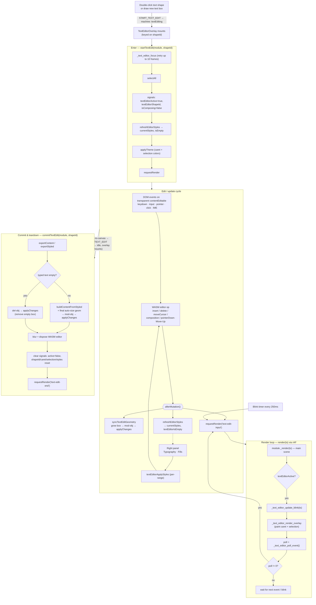

# Text editing in `skia-rs-wasm` — current flow

How interactive text editing works today: the state machine, the enter →
edit/update → commit cycle, and the focus-retry race guard.

## Two-layer design

Text editing is split across two layers (mirrors Penpot's `v3_editor`):

- **The *mode*** lives in the XState canvas machine — the `textEditing` state
  (`src/lib/renderer/machine/canvas-machine.ts`). It holds only *which* shape is
  being edited (`textEditingShapeId`).
- **The *per-frame data*** (caret/selection geometry, composing flag, live
  styles, empty flag) lives in Preact signals (`src/lib/renderer/signals/text-editor.ts`),
  so the render loop and overlay never go through React.

The actual text **and caret are painted by WASM**, not the DOM. The DOM
`contentEditable` (`TextEditorOverlay`) is a transparent capture surface for
keyboard / IME / pointer only — its own text/caret are invisible and its
`textContent` is cleared after every input.

## States & transitions



Entry into `textEditing` happens three ways:

- **Double-click a text shape** → hit-test → `START_TEXT_EDIT`
  (`src/lib/renderer/hooks/use-viewport-interactions.ts:317`).
- **Draw a new text box** → `drawingShape.onDone` guard `pendingTextEdit.id != null`
  (`canvas-machine.ts:190`).
- **Double-click race** → the `moving` state also accepts `START_TEXT_EDIT`, so a
  dbl-click whose move-actor hasn't settled isn't dropped (`canvas-machine.ts:130`).

While in `textEditing`, `START_TEXT_EDIT` with no target switches text shapes
without bouncing through `idle`. `STOP_TEXT_EDIT` (Escape, blur-to-canvas)
returns to `idle`. Other machine states (resizing, rotating, selecting, panning,
draggingGradient) are not part of the text flow.

## Enter / edit-update / commit cycle



### Enter — `startTextEdit()` (`handlers/text-edit.ts:74`)

Focus the WASM editor (retried — see below), `selectAll`, flip
`textEditorActive=true`, apply the caret/selection theme, request a frame.

### Edit/update cycle (`components/Overlay/TextEditorOverlay.tsx`)

Every DOM event on the overlay forwards to a WASM op, then runs `afterMutation()`
(`TextEditorOverlay.tsx:148`), which does three things:

1. `syncTextEditGeometry` — grows the box to fit the text every keystroke via a
   geometry-only `mod-obj` `applyChanges` (no `content`, so the live buffer /
   cursor stay intact).
2. `refreshEditorStyles` — pulls `currentStyles` + `textEditorIsEmpty` so the
   Typography/Fills panels reflect the live selection.
3. `requestRender`.

The right-side panels (Typography/Fills) feed the *same* cycle through
`textEditorApplyStyles` (per-range styling).

### Render loop — `render(ts)` (`api/rendering.ts:19`)

Paints the main scene, then *if `textEditorActive`*: `update_blink` →
`render_overlay` (caret + selection) → `poll_event`. If `poll != 0`, it
self-schedules another frame. A separate **250 ms blink timer** keeps requesting
frames so the caret keeps toggling even when idle.

### Commit & exit — `commitTextEdit()` (`handlers/text-edit.ts:336`)

Runs on overlay unmount: export content; if empty → `del-obj` (remove the empty
box, matches Figma/Penpot); else `buildContentFromStyled` + re-assert final
auto-size geometry → `mod-obj` through the normal `applyChanges` pipeline; then
`blur` + `dispose` the WASM editor and clear all signals.

## The focus retry (race guard)

In the overlay's mount effect (`TextEditorOverlay.tsx:90`):

```ts
let raf = 0
let tries = 0
const tryStart = () => {
  if (startTextEdit(module, shapeId) || tries++ >= 10) return
  raf = requestAnimationFrame(tryStart)
}
tryStart()
```

`startTextEdit` returns the boolean from `textEditorFocus` → the Rust
`text_editor_focus` (`render-wasm/src/wasm/text_editor.rs:45`), which returns
`false` in two cases:

```rust
let Some(shape) = state.shapes.get(&shape_id) else {
    return false;          // shape not in the WASM scene (yet)
};
if !matches!(shape.shape_type, Type::Text(_)) {
    return false;          // shape isn't a text node
}
state.text_editor_state.focus(shape_id);
true
```

The first case is the one that matters. When you draw a **new** text box, the
machine drops straight from `drawingShape` into `textEditing` and the overlay
mounts immediately — but the shape was created through the async
`applyChanges → worker → WASM` pipeline, so on the first frame it often isn't in
`state.shapes` yet. `text_editor_focus` returns `false`, and without a retry the
editor never attaches: no caret, can't type.

The retry:

- Re-calls `startTextEdit` each frame; the moment focus succeeds the `||`
  short-circuits and the loop stops (that successful call also does the
  `selectAll` / signal flips / theme / render).
- Gives up after **10 frames** (~160 ms) so it can't spin forever on a bad id.
- The effect cleanup runs `cancelAnimationFrame(raf)`, cancelling a pending retry
  if edit mode exits before focus took.

For a double-click on an *existing* text shape it almost always succeeds on the
first try (the shape is already in the scene), so the loop is a single iteration.
The reasoning is also documented at `handlers/text-edit.ts:65`.
